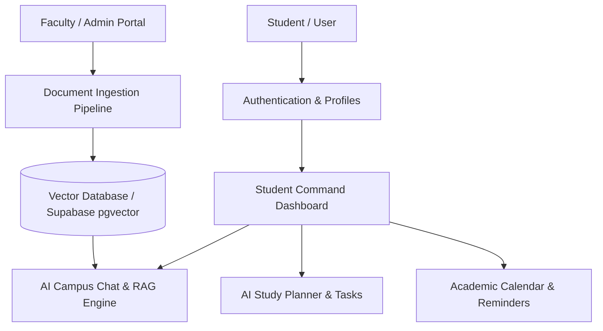

# Campus Copilot (UniMate CampusNexus) — Project Working Report

**Document Version:** 1.0.0  
**Repository:** [komalpreetsandhu147/Unimate-campusNexus](https://github.com/komalpreetsandhu147/Unimate-campusNexus.git)  
**Target Pilot:** Akal University (Talwandi Sabo, Punjab)  
**Date:** September 2026  

---

## 1. Executive Summary

**Campus Copilot** (UniMate CampusNexus) is an AI-powered academic operating system designed for university students and campus communities. It bridges the gap between fragmented university data (notices, syllabi, exam schedules, circulars, portal announcements) and daily student action (study planning, deadline tracking, task completion, and personalized AI assistance).

The project is structured around the student loop:
$$\text{ASK} \longrightarrow \text{UNDERSTAND (RAG)} \longrightarrow \text{ACT (Tasks \& Calendars)}$$

---

## 2. What Is Currently Served (Current Implementation)

Currently, the project has a production-ready, high-converting **Front-Facing Landing and Waitlist Portal** integrated with Supabase backend services.

### Implemented Modules & Features:

| Component | Status | Description |
| :--- | :--- | :--- |
| **Hero & Value Proposition** | ✅ Live | Showcases core mission, dynamic call-to-actions, and interactive mock command-center UI preview. |
| **Simulated Copilot Command UI** | ✅ Live | Demonstrates verified AI answers, citation badges, source PDFs (`Course syllabus.pdf`, `Notice #104`), and action triggers. |
| **The Student Loop Workflow** | ✅ Live | 3-step interactive breakdown: *01 Ask naturally*, *02 Ground the answer*, *03 Make it happen*. |
| **Feature Suite Matrix** | ✅ Live | 6 core capability cards: AI Campus Chat, RAG Knowledge Assistant, Task Generator, AI Study Planner, Smart Reminders, Command Dashboard. |
| **Intelligence Layer Architecture** | ✅ Live | Visual representation of the AI/RAG engine connecting university documents to calendar, tasks, and verified answers. |
| **University Spotlight Section** | ✅ Live | Dedicated showcase for the launch campus (**Akal University, Talwandi Sabo**). |
| **Early Access & Waitlist Capture** | ✅ Live | Active submission form connected to Supabase PostgreSQL with duplicate prevention and instant feedback states. |
| **Database Security (RLS)** | ✅ Live | Row-Level Security enabled on `waitlist_signups` (write-only policy for anon users to prevent email harvesting). |

### Current Technical Stack:
- **Frontend Framework:** React 18 with TypeScript & Vite
- **Styling:** Tailwind CSS + Custom Design System (`index.css`)
- **Icons:** Lucide React
- **Backend / Database:** Supabase (PostgreSQL + RLS)
- **Deployment Ready:** Strict linting, type-checked build pipeline (`npm run build`)

---

## 3. Functionality That Needs to Be Built (Target Roadmap)

To evolve Campus Copilot from a waitlist and landing page into the full working **AI Operating System for Students**, the following subsystems must be engineered:



---

### Phase 1: Authentication, Roles & Profiles
*Goal: Provide personalized access for students, campus admins, and faculty.*

- [ ] **Campus Authentication:**
  - Email/password and OAuth (Google / Microsoft institutional login).
  - Domain validation for `@akaluniversity.ac.in` student/faculty email addresses.
- [ ] **Student Profiles:**
  - Academic metadata: Degree, Department, Branch, Year, Current Semester.
  - Course enrollment selection (so AI responses prioritize their specific subjects).
- [ ] **Role-Based Access Control (RBAC):**
  - Roles: `Student`, `Faculty/Professor`, `Department Admin`, `Super Admin`.

---

### Phase 2: RAG Knowledge Assistant & Document Ingestion Pipeline
*Goal: Convert unstructured PDFs and notices into verifiable, citation-backed AI answers.*

- [ ] **Admin & Faculty Upload Portal:**
  - Secure portal to upload Syllabi, Timetables, Examination circulars, Fee notices, and Event flyers.
- [ ] **Document Processing & Chunking:**
  - Automated PDF text and table extraction.
  - Semantic chunking preserving document hierarchy (dates, course codes, headings).
- [ ] **Vector Search & Embedding Engine:**
  - Setup `pgvector` in Supabase (or external vector DB).
  - Generate embeddings using OpenAI `text-embedding-3-small` or Google Gemini Embedding API.
  - Metadata tagging: `course_code`, `valid_until`, `department`, `document_type`.
- [ ] **Grounded RAG Generation:**
  - Response generation strictly grounded in university documents with clickable page citations and confidence scores.

---

### Phase 3: Interactive AI Campus Chat Application
*Goal: Give students a real-time copilot interface for academic inquiries.*

- [ ] **Real-time Chat Interface:**
  - Streaming token responses with smooth rendering.
  - Markdown formatting, tables, formula rendering (LaTeX/KaTeX), and code blocks.
- [ ] **Conversational Memory:**
  - Multi-turn conversation sessions saved to user profile.
- [ ] **Actionable Suggestions:**
  - Post-response action chips: *"Add exam date to calendar"*, *"Create checklist from assignment instructions"*, *"Download referenced PDF"*.

---

### Phase 4: Task & Checklist Generator + AI Study Planner
*Goal: Automatically convert course demands into manageable daily study tasks.*

- [ ] **Automated Task Extraction:**
  - Parse assignment prompts and generate step-by-step checklists.
- [ ] **Adaptive Study Planner:**
  - Input: exam dates and course syllabi; Output: customized revision schedules tailored to student pace.
- [ ] **Kanban / Task Progress Board:**
  - Todo, In-Progress, Completed states with progress tracking and streak counters.

---

### Phase 5: Academic Calendar, Timetables & Smart Reminders
*Goal: Keep students ahead of all deadlines with proactive alerts.*

- [ ] **Interactive Academic Calendar:**
  - Class timetable view, assignment due dates, semester exams, and university holidays.
- [ ] **External Calendar Sync:**
  - Export to Google Calendar, Apple Calendar, and Outlook via `.ics` feeds.
- [ ] **Proactive Notifications:**
  - In-app notification bell.
  - Configurable alerts via Email, WhatsApp API, or Telegram bot before critical deadlines.

---

### Phase 6: Student Command Dashboard & Admin Analytics
*Goal: Single pane of glass for student daily workflow and administrative insights.*

- [ ] **Student Dashboard Home:**
  - Daily overview: Today's lectures, pending tasks, upcoming deadlines, and pinned campus announcements.
- [ ] **Campus Directory & Quick Links:**
  - Faculty cabin locations, office hours, departmental contact numbers, library resources.
- [ ] **Campus Admin Analytics:**
  - Top search queries and frequently asked student questions (anonymized).
  - Knowledge gaps identification (identifying questions with missing campus documentation).

---

## 4. Proposed Database Schema Architecture (Supabase / PostgreSQL)

```sql
-- 1. Profiles & Academic Metadata
CREATE TABLE profiles (
  id uuid PRIMARY KEY REFERENCES auth.users(id),
  full_name text NOT NULL,
  university_id text,
  department text,
  semester int,
  created_at timestamptz DEFAULT now()
);

-- 2. Official Campus Documents & Embeddings
CREATE TABLE campus_documents (
  id uuid PRIMARY KEY DEFAULT gen_random_uuid(),
  title text NOT NULL,
  category text, -- 'syllabus', 'exam_notice', 'circular'
  file_url text NOT NULL,
  uploaded_by uuid REFERENCES auth.users(id),
  created_at timestamptz DEFAULT now()
);

CREATE TABLE document_chunks (
  id uuid PRIMARY KEY DEFAULT gen_random_uuid(),
  document_id uuid REFERENCES campus_documents(id) ON DELETE CASCADE,
  content text NOT NULL,
  metadata jsonb DEFAULT '{}',
  embedding vector(1536) -- For pgvector similarity search
);

-- 3. AI Chat Threads & Messages
CREATE TABLE chat_threads (
  id uuid PRIMARY KEY DEFAULT gen_random_uuid(),
  user_id uuid REFERENCES auth.users(id) ON DELETE CASCADE,
  title text NOT NULL,
  created_at timestamptz DEFAULT now()
);

CREATE TABLE chat_messages (
  id uuid PRIMARY KEY DEFAULT gen_random_uuid(),
  thread_id uuid REFERENCES chat_threads(id) ON DELETE CASCADE,
  role text CHECK (role IN ('user', 'assistant')),
  content text NOT NULL,
  citations jsonb DEFAULT '[]',
  created_at timestamptz DEFAULT now()
);

-- 4. Tasks & Study Plans
CREATE TABLE student_tasks (
  id uuid PRIMARY KEY DEFAULT gen_random_uuid(),
  user_id uuid REFERENCES auth.users(id) ON DELETE CASCADE,
  title text NOT NULL,
  due_date timestamptz,
  status text CHECK (status IN ('todo', 'in_progress', 'completed')) DEFAULT 'todo',
  created_at timestamptz DEFAULT now()
);
```

---

## 5. Implementation Priority Matrix

| Priority | Module | Effort | Impact | Key Dependency |
| :--- | :--- | :--- | :--- | :--- |
| **P0 (Immediate)** | Supabase Auth & Student Profiles | Medium | Critical | Supabase Auth API |
| **P0 (Immediate)** | Document Ingestion + `pgvector` Setup | High | Critical | Supabase `pgvector` extension |
| **P1 (Core)** | Real-time AI Campus Chatbot with Citations | High | Critical | OpenAI / Gemini API |
| **P1 (Core)** | Student Command Dashboard Shell | Medium | High | UI Layout & Routing |
| **P2 (Growth)** | Task Generator & Study Planner | Medium | High | Chat tool calling |
| **P2 (Growth)** | Academic Calendar & Reminders | Medium | High | Notification services |
| **P3 (Scale)** | Admin Analytics & Ingestion Dashboard | High | Medium | Admin RBAC |

---

## 6. Next Steps

1. **Setup Client-Side Routing:** Add `react-router-dom` to support `/login`, `/dashboard`, `/chat`, and `/admin` while keeping `/` as the landing page.
2. **Enable Supabase Auth:** Configure Google / Email login and create the `profiles` table.
3. **Initialize Vector Search:** Run the `pgvector` migration in Supabase and build a sample document ingestion script for Akal University syllabi and notices.
4. **Deploy AI Chat Endpoint:** Connect LLM streaming with RAG retriever for verified campus answers.
